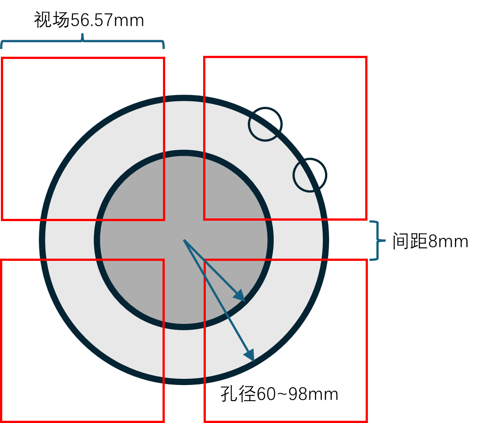
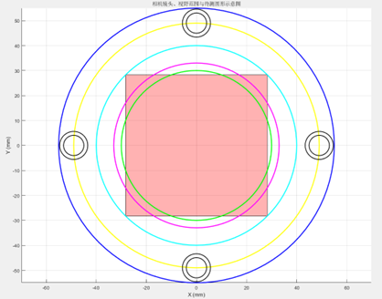
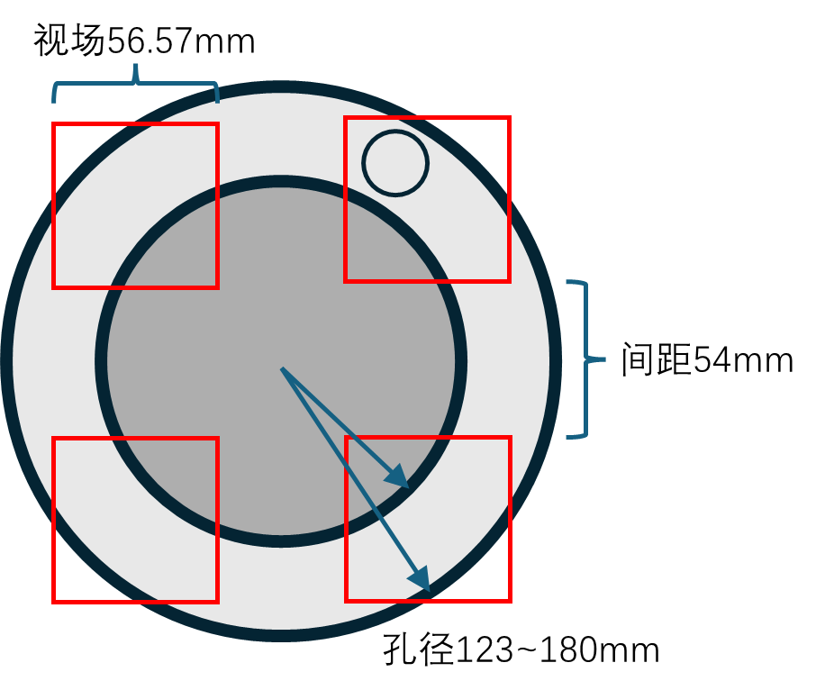
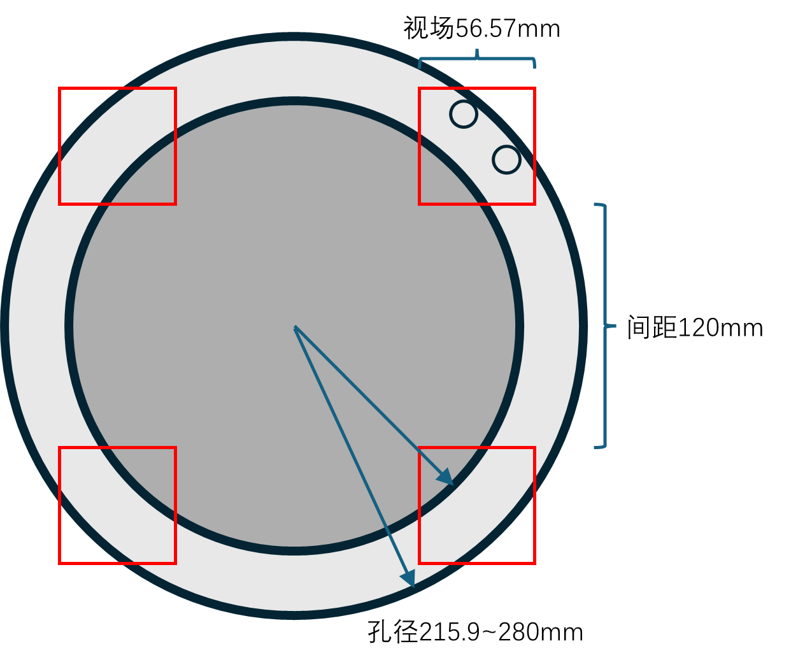
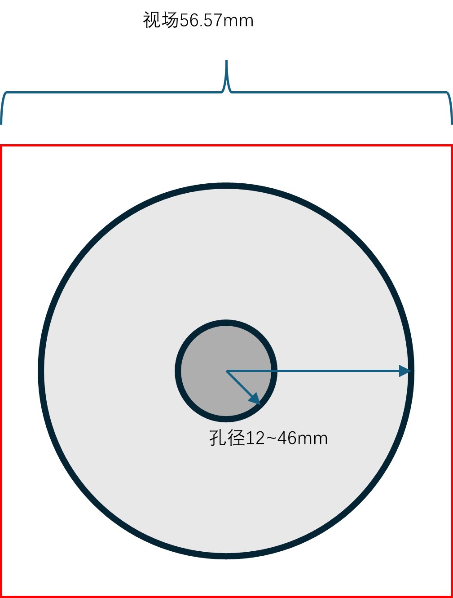
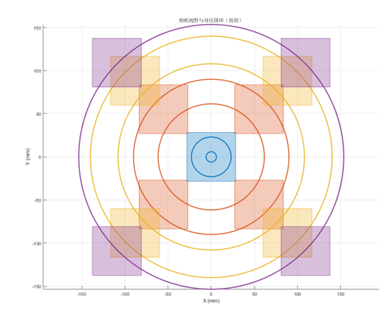

# 远心镜头阵列大尺寸精密测量系统方案设计
## 一、项目背景
对于大尺寸阀体零件的测量，传统的透视成像相机虽然具备较大的视场范围，但由于阀体上的待测轮廓存在明显的高度差，即使经过精密标定，透视相机因成像存在透视畸变，仍难以实现高精度尺寸测量。为克服这一问题，可采用远心镜头进行平行成像，避免透视误差。然而，远心镜头的视场范围较小，难以覆盖整个零件区域。因此，本方案采用 2×2 的远心镜头阵列进行成像，以实现对大尺寸区域的高精度测量。

对于大尺寸阀体零件上的圆孔结构，可根据孔径大小采用不同测量方式：对于小孔（最小直径为 8.1 mm），使用单个远心相机即可完成精密测量；而对于大孔（最大直径达 307 mm），可分别使用阵列中的四个远心镜头对圆孔的四个区域进行成像，并通过高精度图像拼接重建完整圆孔结构，从而实现高精度尺寸测量。

## 二、设计目标
- 单相机测量小圆孔，误差小于10μm。
- 阵列相机测量大圆孔，误差小于20μm。
- 拼接视野范围可覆盖整体零件（最大307mm）。
- 无畸变成像，即对透视误差进行有效矫正。
- 标定流程简便，可复现。

## 三、系统组成
### 3.1 远心镜头DTCM111-80H-AL
- 双侧远心
- 最大靶面1.1''
- 像方畸变<0.1%
- 物方工作距228±4mm
- 物方远心度<0.1°
- 镜头尺寸110mm
- 视野范围80mm

### 3.2 相机MV-CH250-90GC
- 5120×5120分辨率彩色
- 靶面尺寸1.1''
- 最大帧率4.5fps
- 像元尺寸2.5μm×2.5μm

### 3.3 halcon标定板GB050-2.5-7×7
- 图案尺寸40×40mm
- 标志点直径2.5mm
- 中心距5mm
- 阵列7×7

## 四、核心技术路线
为实现对大尺寸零件的高精度成像与无缝拼接，本系统设计将围绕远心光学成像、相机阵列协同布置、多视角图像拼接与校准、系统同步控制等多个关键技术点展开，确保系统整体的测量精度、稳定性与可重复性。主要包括以下几方面：

### 4.1 远心成像系统设计
传统镜头存在透视畸变，尤其在大尺寸零件的边缘位置容易产生几何形变，不利于尺寸测量与图像拼接，另外考虑到镜头与传感器之间的倾斜会导致测量出现误差。为避免上述问题，采用双侧远心镜头进行成像。远心镜头在视野范围内可保证所有入射光线近似平行，使得物体尺寸在图像中不随物距变化而改变，适合高精度测量。相较普通镜头，成像比例一致，有利于拼接时的几何一致性。远心镜头通常具有较大的景深，适合对凹凸不平或深度变化的工件进行稳定成像。远心镜头需根据目标尺寸、相机分辨率、测量精度、工作距离等进行匹配设计，确定放大倍率及视野范围。 基于相机分辨率和视野范围可确定，测量系统的灵敏度为0.011mm/pix。

### 4.2 相机阵列布局规划
单台相机的视野有限，对于大尺寸孔径的测量，无法覆盖整个工件，因此需设计多相机阵列系统进行并排拼接成像。每台相机覆盖一定宽度，整体拼接后覆盖全尺寸区域，无重叠视场。安装时使用水平仪确保相机光轴近似垂直于待测平面，微小倾斜后期可通过相机标定去除。

### 4.3 标定与拼接算法
单相机内参标定：获取每台相机的畸变参数、放大率和倾斜角等，用于后期图像的几何校正及拼接。使用halcon及圆点标定板进行标定。

相机间外参标定：将所有相机的图像统一到一个坐标系中，或将所有的相机坐标系进行统一，用于图像的精密拼接。对于远心成像，不涉及透视变换，可以用单应性矩阵的乘积及SVD分解求得。

图像拼接：根据外参关系计算图像的相对位置，还包括图像的几何旋转、亮度均衡等算法及亚像素精细。

### 4.4 相机同步触发及模块封装
同步触发：通过采集卡同步软触发，确保图像之间的时间一致性。

模块封装：对标定、采集、拼接等模块进行封装，确保程序线程的安全。

## 五、安装位置计算
### 5.1 待测孔径位置汇总
端盖上下部共有10个圆孔需检测，圆孔均为轴对称，上部圆孔直径：
-	166mm
-	180mm
-	218mm
-	240mm
-	258mm
-	307mm

下部圆孔直径：
-	150mm
-	188mm
-	215.9mm
-	280mm

阀座上下部共有7个圆孔需检测，圆孔均为轴对称，上部圆孔直径：
-	156mm
-	163mm
-	168mm

下部圆孔直径：
- 150mm
-	166mm
-	173mm
-	180mm

阀体A上部和右侧共有7个圆孔需检测，圆孔均为轴对称，上部圆孔直径：
-	60mm
-	66mm
-	80mm
-	123mm

右侧圆孔直径：
-	240mm
-	258mm
-	307mm

阀体B只有2个圆孔需检测：
-	278mm
-	12.7mm（7处，分布于278mm直径的环上）

阀体C共有3个圆孔待检测：
-	8.1mm（2个，距中心98mm）
-	11.1mm（4个，距中心98mm）
-	98mm

支架共4个圆孔待检测：
-	165mm
-	130mm
-	22mm（4个，距中心165mm）
-	13mm（4个，分布于侧面，不能使用相机阵列测量）

阀杆共3个圆孔：
-	12mm
-	35mm
-	46mm

球体共3个圆孔：
-	60mm（上部）
-	60mm（下部）
-	150mm（右侧）

### 5.2 相机位置计算
对于单个轴对称圆孔，要求成像尽可能靠近图片中心，单个轴对称圆孔最大直径为307mm（端盖），最小直径为60mm（阀体A），单圆孔尺寸相差较大，无法固定相机以满足适配。考虑根据圆孔直径分类，对每一类别采用不同的相机阵列布局，各种布局可使用位移台移动相机实现。单个相机成像范围为56mm*56mm，镜头口径110mm即两相机光轴最小间距应大于55mm。

- 孔径范围60~98mm
阀体A：60/66/80，阀体C：8.1*2-98/11.1*2-98/98，球体：60*2。上述圆孔可分第一类，采取相邻间隔约为8mm，此时对上述尺寸圆孔均可清晰且较完整成像，成像区域原理视场边缘。

但是在该情况下需要考虑镜头的口径，由于成像范围小于镜头的口径，导致被镜头覆盖的位置并不会完全成像，而由于镜头之间的阻隔，该情况也无法使用多相机共同拍摄。

如上图所示，红色半透明掩膜为实际成像区，最外圈深蓝色为镜头的口径。两者中间为视野盲区，可以看到，绿色的待测孔径（直径60mm）和紫色的待测孔径（直径66mm）可以使用单相机拍摄不完全的孔径边缘进行测量，而淡蓝色孔径（直径80mm）和黄色孔径（直径98mm）以及分布在直径98mm上的待测小圆孔，无论采用单相机或是多相机均无法检测到。此情况则需要移动单相机逐一拍摄，或利用其它方案进行检测。

- 孔径范围123~180mm
阀体A:123，端盖166/180/150/188，阀座：156/163/168/150/166/173/180，支架：165/130/22*4-165，球体：150。上述圆孔分为第二类，采取相邻间隔约为54mm。

- 孔径范围215.9~280mm
端盖：218/240/258/215.9/280，阀体A：240/258，阀体B：278/12.7*4-278。上述圆孔为第三类，相邻间隔120mm。

- 孔径307mm
端盖：307，阀体A：307。上述圆孔为第四类，相邻间隔280 * 2mm，相邻间隔约为162mm。

- 孔径范围12~46mm
阀杆12/35/46.上述圆孔为第五类，可用单个相机进行测量。

综上所述，可以将所有相机位置及每个位置所测量的最大最小孔径绘制在一幅图中，如下图所示，图中的方框代表实际成像位置，与之颜色对应的圆为改组待测的最大最小孔径，可以看到，孔径边缘在视场的中心位置，成像质量高，对结果有积极影响。

## 六、系统搭建与校准流程
### 6.1 系统搭建
上述共将待测圆孔分为5类，5种类型之间的切换可使用双轴精密位移滑台移动相机以达到适配，对于各零件各孔径的高度不同，远心镜头的景深不足等问题，可搭配普通升降台，将各圆孔对焦后进行测量。

初始搭建方案按照类别一进行，即相机与相机间隔为9mm，光轴间隔64mm。

### 6.2 联合标定板布局
综上所述，可以将类别一中的两个待测孔径划分至类别五，而其余孔径由于相机等布局因素不适用于该测量方法，则对于类别二、三、四所述的相机布局，需要一个统一的联合标定版进行外参标定与求解。

上图为初步设计的联合标定版布局，其分布在270*270mm的空白平面上，共有12组6*7，边长为4mm的小标定板组成，确保各小标定板在每组相机的视野范围之内。每个小标定板的标志点数量为30，满足优化算法远大于3个标志点的要求。小标定板的顶点相接，以便于求得其几何位置关系。中间蓝色视野为单相机测量，因此不需要进行额外的外参标定，也不需要设计标定板。

### 6.3 内外参标定算法
内参的标定可用halcon的标定工具箱，其包含了双侧远心镜头的标定及倾斜校正算法。对每个相机拍摄不同位姿的标定板，且确保标定板覆盖到了相机的每个边缘，单个相机需拍摄20张以上图片，通过标定工具箱可得到单相机的放大倍率、畸变参数以及倾斜角。

外参的标定可以使用PnP算法求变换矩阵，由于系统采用远心相机，故求得矩阵应为3×3仿射变换矩阵，外参标定步骤如下：

首先需要四个已知位置的标定板，四个标定板的位置均在统一坐标系下，用四个相机分别拍摄四个标定板，提取其角点坐标并记录其相对位置。

可先确定一个主相机，然后将子相机的图像变换到主相机的图像坐标系。使用PnP算法求得每个相机的仿射变换矩阵。

利用变换关系将子相机的三幅图变换至主相机图像中即可。

该变换关系只要相机的位置恒定，可适用于任意图片，因此内外参的标定结果有：畸变参数、倾斜角度、放大倍率以及仿射变换矩阵，其对于任意图像，均可通过图像操作进行拼接。

### 6.4 图像拼接算法
使用外参对图像坐标系进行统一处理，即可完成图像拼接，相较于匹配拼接，速度快，精度高。

### 6.5 测量实验及误差校验
对类别五的各圆孔进行测量，可得知单一相机的误差，重点是先处理好单相机的精度，再对多相机的拼接精度做更高要求。

## 七、技术难度与后续扩展方向
多相机之间无共同视场，无法通过特征匹配进行图像的拼接，只能通过标定外参拼接，如何设计一个外参标定方案是该项目的重点。

当待测物的尺寸增大后，拼接的图像也随之增大，但其中无用信息也越来越多，如何优化图像的存储而不降低测量的准确性也是项目需要解决的一大问题。

由前述计算可知，对于该系统灵敏度约为11μm/pix，而要求为10μm以下，如何提升亚像素精度也是本项目需要解决的问题。

后续可增设升降台及精密位移台，以适配要求中所有孔径的拍摄检测，并可通过型号自适应调整相机位置。
